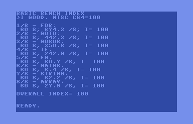

# bench64 - a new BASIC benchmark index for 8-bit computers

This is a portable BASIC benchmark that tests eight separate aspects
of interpreter speed. Each test has been designed to run for exactly
one minute on an NTSC Commodore 64. A computer that completes all of
the tests in exactly eight minutes has a performance index
of 100. Such a computer would generate the following report:

    BASIC BENCH INDEX
    >I GOOD. NTSC C64=100
    
    1/8 - FOR:
     60 S; 674.5 /S; I= 100
    2/8 - GOTO:
     60 S; 442.3 /S; I= 100
    3/8 - GOSUB:
     60 S; 350.8 /S; I= 100
    4/8 - IF:
     60 S; 242.9 /S; I= 100
    5/8 - FN:
     60 S; 60.7 /S; I= 100
    6/8 - MATHS:
     60 S; 6.4 /S; I= 100
    7/8 - STRING:
     60 S; 82.2 /S; I= 100
    8/8 - ARRAY:
     60 S; 27.9 /S; I= 100
    
    OVERALL INDEX= 100

The numbers given for each test are the elapsed time in seconds, the
rate (per second) that each test ran, and the computed index for that
test.

## Guiding principles

> “… many professionals and computer enthusiasts criticized BASIC for
> its simplicity, how it handled tasks, and the way in which it did
> not maximize or fully utilize the power of the computer
> itself. However, those criticisms missed the point completely.”

> — Rankin, Joy Lisi. [A People’s History of Computing in the United
> States](https://www.hup.harvard.edu/catalog.php?isbn=9780674970977)
> Harvard University Press, 2018. Chapter 3, p.66–7

1. All synthetic benchmarks are false.
   
2. My computer is better than your computer because *thbbft*!

## Design Guidelines

* The suite uses a stock North American (NTSC) Commodore 64 ("C64") as
  a baseline. These are perhaps the most common 8-bit computers ever
  made, and thus the stock of suitable testbenches is still large.
  
* A result of 100 would indicate the same performance as a C64. 200
  would indicate twice the performance, and 50 half
  
* Any features not available in Commodore BASIC 2.0 will not be tested

* Portability is a key goal: commands will be separated by spaces (not
  "crunched"), and only one command per line
  
* Each test should take as close to 60 seconds on a C64 as practical

* The tests will be timed with the computer's own internal clock, and
  require 0.1 s or better resolution
  
* Tests will be incremental, where possible. That is to say, each test
  will rely on the results of earlier tests to calculate the time
  burden particular to that test.
  
* Minor changes to the code for compatibility are allowed, but changes
  for the sake of speed are not. For example, Sinclair BASIC uses `GO
  TO` and `GO SUB` instead of `GOTO` and `GOSUB`, string slicing instead of
  LEFT$ (etc.) and requires a sequence of PEEKs to get the elapsed time
  (ref:
  [Motion](https://worldofspectrum.org/ZXBasicManual/zxmanchap18.html)). These
  are all allowable. Using Acorn BBC BASIC's fast integer variables,
  however, is not.
  
* For improved portability, variables will be assigned using `LET`

## Test Descriptions

All tests are carried out inside `FOR ... NEXT` loops. The number of
loops is initially tuned to take 60 s on an NTSC Commodore 64.

1. **FOR** - a `FOR ... NEXT` loop with no content.

2. **GOTO** - a `GOTO` the `NEXT` statement.
   
3. **GOSUB** - a `GOSUB` out of the loop with a simple `RETURN` as the
   target. 

4. **IF** - in place of the simple loop's `NEXT` statement, use
   `IF I>0 THEN NEXT I`. This is followed for every iteration.

5. **FN** - a modulo 10 user-defined function is run across the loop
   variable. Note that C64 BASIC has no `MOD` function: use
   `A-INT(A/B)*B` instead.
   
6. **Maths** - the equivalent of `LET A=(TAN(ATN(SQR(A*A)))+1)/A` is
   calculated. This is modified from [ClockSp
   3.00](https://stardot.org.uk/forums/viewtopic.php?f=2&t=19819&start=30#p276764). The
   modification prevents overflow, and by happy coincidence, the value
   of A converges onto the [golden
   ratio](https://en.wikipedia.org/wiki/Golden_ratio).

7. **String Manipulation** - the 36 character string
   `"ABCDEFGHIJKLMNOPQRSTUVWXYZ1234567890"` is rotated left one
   character, becoming `"BCDEFGHIJKLMNOPQRSTUVWXYZ1234567890A"` after
   the first iteration.

8. **Array Subscripts** - a 12 entry `a()` is pre-filled with
   1 .. 12. For all but the first and last items,
   `A(X)=(A(X-1)+A(X)+A(X+1))/3` where `X` is calculated from the loop
   variable using the user-defined function used in test 5.

## Limitations

Does not produce useful results for very fast computers where test
durations tend towards zero. BASIC is not typically used on such
computers.

Won't ever run correctly on Atari BASIC, because it doesn't have user-
defined functions. Soz, Maury … ☹

## Results

### Reporting results

1. Please use the machine exactly as it would appear when turned
   on. Tricks like turning off interrupts to get better results should
   not be done.
   
2. The index value is to be reported as an integer. Benchmarking 8-bit
   computers is not an exact science.
   
3. The code should be modified as little as possible to ensure that it
   runs and (where possible) reports time fairly. "Crunching" the code
   or modifying it to use integer variables (where available) must not
   be done. Portability and clarity of the code is more important than
   optimization. *If it runs any faster, it's not the same code.*
   
4. The overall index value is the goal. While individual test index
   values have passing interest, if your platform can't reasonably run
   all of the tests (perhaps through lack of floating point support),
   it cannot return a valid overall index.
   
5. If you modify the code outside these guidelines, call the program
   anything but *bench64*. 

### Real 8/16-bit hardware platform results

* MinZ v1.1 (36.864 MHz Z180, CP/M 2.2, BBC BASIC [Z80] v3): 1839

* Amstrad PPC640 (8 MHz NEC V30, GW-BASIC 3.20): 380

* Acorn BBC Micro Model B (2 MHz 6502, BBC BASIC v2): 208

* Commodore 64c (NTSC): 100

* ZX Spectrum 48k: 29

### Emulated platform results

Baseline I=100 for "new" NTSC Commodore 64c. Older machines (`x64sc
--model oldntsc`) may be very slightly slower, but still average out
to give I=100. Any Commodore machines listed below are NTSC unless
stated otherwise.

* Commodore PET 2001: 90

* Commodore PET 4032: 87
  
* Commodore PET 8032 / 8296: 83
  
* Commodore VIC-20: 106

* Commodore 64 (PAL): 97

* Commodore C128: 71

* Commodore C128 (C64 mode): 100

* Commodore +4 / C-16: 78

* Amstrad CPC6128: 169

* Amstrad CPC6128 (BBC BASIC): 130

* MSX1 (NTSC): 73

* IBM PC (4.77 MHz 8088, PC-DOS 1.10): 140

* Tandy Color Computer: 90

**Fun fact**: the early Commodore PETs have a bug in their `GOTO`
code. If I'd renumbered the code starting at line 260 instead of line
10, the PET would have come out *faster* than the reference
system. This is why it's important to avoid any system-specific
optimization in a benchmark that aims to be fair and portable.

### Modern micro-controller platform results

Even this tiny processor's getting almost too fast to benchmark:

* [mmbasic on Raspberry Pi Pico](https://www.thebackshed.com/forum/ViewTopic.php?PID=175254#175254): 6018
* [BBC BASIC on Raspberry Pi Pico](https://www.raspberrypi.org/forums/viewtopic.php?f=144&t=316761&start=625#p1912334): 17978

### Porting notes by platform

#### Amstrad CPC

Change

    DEF FND(X)=(TIME-X)/60

to

    DEF FND(X)=(TIME-X)/300

#### BBC Micro

Change

    DEF FND(X)=(TIME-X)/60

to

    DEF FND(X)=(TIME-X)/100

#### mmbasic

* change `DEF FN` to `FUNCTION ... END FUNCTION`
* change name of function `R` to `FR` as functions and variables can't have the same name
* use and reset mmbasic's millisecond TIMER variable

#### Generic - No Timer

Change

    260 REM MACHINE SPECIFIC TIME FUNCTION
    270 DEF FND(X)=(TIME-X)/60

to

    260 REM MACHINE SPECIFIC TIME FUNCTION
	265 LET TMIE=0
    270 DEF FND(X)=60

Doesn't actually do anything, so you have to time output and calculate
results yourself. The program `bench64_output` will help you do
that. A screen recorder can help work out timings by reviewing when
each test starts and stops by counting video frames.

References to `TIME` have been changed to `TMIE` to improve compatibility.

#### ZX Spectrum

Has no timer function built-in, but change

    260 REM MACHINE SPECIFIC TIME FUNCTION
    270 DEF FND(X)=(TIME-X)/60

to

    260 REM MACHINE SPECIFIC TIME FUNCTION
	262 DEF FN N(X,Y)=(X+Y+ABS (X-Y))/2
	264 DEF FN U()=(65536*PEEK 23674+256*PEEK 23673+PEEK 23672)/50
	266 DEF FN T()=FN N(FN U(),FN U())
    270 DEF FN D(X)=FN T()-X

then use `FN T()` instead of `TIME`. The *T* variable should be
changed to avoid a clash with the user-defined function: I used *V*,
for no particular reason. Don't forget to address `GO TO` and 
`GO SUB`, plus Sinclair BASIC's unique `a$([n] TO [m])` string-slicing
syntax. Oh, and that `END` isn't a keyword in Sinclair BASIC.

#### MSX BASIC

If you're using an EU / PAL / 50 Hz machine, change

    DEF FND(X)=(TIME-X)/60

to

    DEF FND(X)=(TIME-X)/50

#### IBM PC

##### IBM Personal Computer Basic (early)

*The IBM Personal Computer Basic* Version D1.10 only has the `TIME$` system
variable, so results have limited resolution. Change

    270 DEF FND(X)=(TIME-X)/60

to

    270 DEF FND(X)=VAL(RIGHT$(TIME$,2))+60*VAL(MID$(TIME$,4,2))

and change all references to `LET T=TIME` (in lines 420, 500, 590,
680, 760, 850, 940 and 1030) to `TIME$="00:00:00"`. Because `TIME$`
is a system/pseudo variable, the interpreter won't let you use `LET`
to set the value.

##### GW-BASIC

While the `TIME$` method described above might work, GW-BASIC has a
`TIMER` keyword that returns a floating point value in seconds. Change

    270 DEF FND(X)=(TIME-X)/60

to

    270 DEF FND(X)=TIMER-X

and all occurrences of `LET T=TIME` to `LET T=TIMER`.

Results may vary from the [many
versions](https://hwiegman.home.xs4all.nl/gwbasic.html#versions) of
the interpreter produce by Microsoft and Compaq over the years.

#### Tandy Color Computer

Replace all `TIME` references with `TIMER`.

## References and Resources

These weren't necessarily used here, but they're all part of the
reading that informed this work.

### BASIC Benchmarking

There are many existing BASIC benchmarks, including:

#### Speed

* "[PCW
  Benchmarks](https://en.wikipedia.org/wiki/Rugg/Feldman_benchmarks)",
  first published in 1977 by Rugg & Feldman in *Kilobaud* magazine,
  and later expanded by John Coll in *Personal Computer World* (PCW)
  magazine.
  
  * short and easy to type in
  
  * all timing is manual
  
  * no string or user-defined function testing.
  
* “[Creative Computing
  Benchmark](https://en.wikipedia.org/wiki/Creative_Computing_Benchmark)”,
  published by David Ahl in *Creative Computing* magazine in 1983.
  
  * short
  
  * tests only numerical and loop speed

  * all timing is manual

  * code is messy with unclear aims.
  
* “[Byte Sieve](https://en.wikipedia.org/wiki/Byte_Sieve)”, published
  in *BYTE* magazine in 1981.
  
  * short
  
  * requires between 16 – 40 K of RAM to store results array, so won't
    run on very small home computers
  
  * tests only numerical loop and simple array subscription speed.
  
  * all timing is manual

* “[ClockSp](http://mdfs.net/Software/BBCBasic/Testing/)” by
  J.G.Harston, later
  [modified](https://stardot.org.uk/forums/viewtopic.php?f=2&t=19819&start=30#p276764)
  by Richard Russell for fairer portability.
  
  * Tests a fair set of language functions
  
  * Scales test size based on processor speed
  
  * Reports results relative to a 2 MHz 6502 Acorn BBC Micro
  
  * Specialized only to the BBC BASIC dialect; utterly non-portable (and
    deliberately so)
  
  * Assumes some system tweaking to make the BBC Micro appear slightly
    faster than its default setting.
	
  * (ClockSp was the inspiration for me starting on this odyssey of
    BASIC bench-marking ...)
	
* “[asciiart.bas](https://www.retrobrewcomputers.org/forum/index.php?t=msg&th=201&goto=4704&#msg_4704)”,
  an informal benchmark that plots the Mandelbrot set in an 80 column
  text terminal.
  
  * unknown outside the retro-computing field
  
  * tests only numerical and loop speed
  
  * quite short
  
  * really needs an 80 column display or the output is messy
  
  * Sometimes limited by terminal output speed: display takes ~2 s
    alone on a 9600 baud terminal
  
  * all timing is manual.
  
* “[mandel.bas](https://unicorn.drogon.net/mandel.bas)”, by Gordon Henderson.

  * designed for portability
  
  * about as well structured as you can get when sticking to simple `IF`s and `GOTO`s
  
  * internal timing (for BBC BASIC as supplied)
  
  * mostly tests floating point addition / subtraction / multiplication / division
  
  * really needs an 80 column display or the output is messy. Conversely,
    [output](https://unicorn.drogon.net/mandel.txt) looks pretty good on an 80-column printer
    
  * takes a while to run: over 23 minutes on a C64.

#### Precision

* [paranoia](https://www.netlib.org/paranoia/paranoia.b) by
  Prof. W. M. Kahan, 1983 (for the IBM PC) (further write-up in [Byte
  Magazine Volume 10 Number 02 - Computing and the
  Sciences](https://archive.org/stream/byte-magazine-1985-02/1985_02_BYTE_10-02_Computing_and_the_Sciences#page/n222/mode/1up)
  by Richard Karpinski)
  
  * written by the architect of the IEEE floating point standard
  
  * will tell you that your floating point routines are bad and that
    you too should feel bad.
	
* [Roger
  Broucke](https://archive.org/details/1982-10-anticmagazine/page/n15/mode/1up?q=broucke)
  benchmark in *Antic* magazine, 1982.
  
  * Mostly a test of whether your floating point is BCD (Atari, MSX,
    Tandy 100, a few others) or binary (everyone else, mostly). Modern
    binary IEEE floating point passes, too
	
  * very short and easy to type in
  
  * has a numeric performance aspect, though not widely known.

### Standards

* [ECMA-55: Minimal BASIC](https://archive.org/details/ecma-55-1978)
    (1978) - a cut-down BASIC with no string handling and none of the
    `MAT` matrix manipulation tools built into Dartmouth BASIC. Very
    similar to ANSI Standard for Minimal BASIC, X3.60-1978, that
    informed Microsoft BASIC design. By meeting US [Federal
    Information Processing
    Standards](https://archive.org/details/federalinformati68nati),
    Microsoft were better able to meet government purchasing
    requirements.

* [ECMA-116: BASIC](https://archive.org/details/ecma-116-1986)
    (1986). Full BASIC, including now-neglected matrix and BCD
    floating point functions.
	
* NBS minimal BASIC test programs: [vol 1 —
    Documentation](https://archive.org/details/nbsminimalbasict5007cugi/page/n5/mode/2up),
    [vol 2 — source and sample
    output](https://archive.org/details/nbsminimalbasic5007cugi_0)
    (1980). Very rigid test routines for Minimal BASIC standards
    compliance. No such test suite exists for Full BASIC, hence the
    core BASIC keywords that “just work” are very few.

### Social History

* Rankin, Joy Lisi. [A People’s History of Computing in the United
  States](https://www.hup.harvard.edu/catalog.php?isbn=9780674970977)
  Harvard University Press, 2018. Chapter 3 (“Back to BASICs”) refers
  to the development of the Dartmouth Time Sharing System (DTSS) in
  the 1960s, of which BASIC was a key component.
  
### Manuals

* [Dartmouth BASIC 4th
  Edition](https://archive.org/details/bitsavers_dartmouthB_3679804)
  manual (1968). Dartmouth College's manual from the DTSS. You likely
  won't like the way that `IF` worked in the original implementation,
  but don't be a Dijkstra about it.

* [The BASIC Handbook : Encyclopedia of the BASIC computer
  language](https://archive.org/details/Basic_Handbook_2nd_Edition_1981_CompuSoft_Publishing),
  by David A. Lien (1981). A cross-reference of many early home
  computer BASIC dialects, highlighting (in)compatibilities and
  workarounds.
  
* [Amstrad CPC 464 User Manual](https://archive.org/details/cpc464.en)
  (1984). Locomotive BASIC, the one I grew up with.
  
* Microsoft [BASIC-80 (MBASIC) Reference
  Manual](https://archive.org/details/BASIC-80_MBASIC_Reference_Manual/mode/2up)
  (1981).
  
* [BBC Microcomputer User
  Guide](https://stardot.org.uk/forums/download/file.php?id=57043)
  (BBC, 1982). Remastered PDF version from Stardot forum users. Forum
  link: [BBC Micro User Guide \[Remastered PDF\] - stardot.org.uk](https://stardot.org.uk/forums/viewtopic.php?t=14024).

* [Sinclair ZX Spectrum BASIC
  Programming](https://worldofspectrum.org/ZXBasicManual/index.html)
  manual (1982/1995)
  
* [Commodore 64 User's
  Guide](https://www.commodore.ca/manuals/c64_users_guide/c64-users_guide.htm)
  (1982).
  
### Current portable BASIC implementations

* [bas](http://www.moria.de/~michael/bas/). Michael Haardt's
  implementation of Full BASIC.

* [BBC BASIC for SDL 2.0 (BBCSDL)](http://www.bbcbasic.co.uk/bbcsdl/),
  by Richard Russell. Richard is a retired BBC engineer who was on the
  original steering committee for BBC BASIC around 1980. He has
  written [numerous
  implementations](http://www.bbcbasic.co.uk/index.html) of BBC BASIC
  (some now freely available) since then. BBCSDL is an open-source
  portable version of his commercial [BBC BASIC for
  Windows](http://www.bbcbasic.co.uk/bbcwin/bbcwin.html) package.

* [Matrix Brandy](http://brandy.matrixnetwork.co.uk/), a
  multi-platform BBC BASIC VI interpreter with optional SDL graphics
  support. 

* [X11-Basic](http://x11-basic.sourceforge.net/), Markus Hoffman's
  BASIC interpreter/compiler for UNIX. Inspired by GFA-BASIC, the late
  Frank Ostrowski's fast but quirky BASIC dialect for the Atari ST.

* ([Decimal BASIC](https://hp.vector.co.jp/authors/VA008683/english/)
  is another Full BASIC implementation, this time with BCD floating
  point and graphics. It can be rather hard to compile.)
  
* [cbmbasic](https://github.com/mist64/cbmbasic), a portable version of Commodore's version of Microsoft BASIC 6502 as found on the Commodore 64. Not a very good interpreter by anyone's standards, but it's familiar to many.

* [PC-BASIC](https://robhagemans.github.io/pcbasic/) - Rob Hagemans' loving recreation of GW-BASIC. Extremely compatible. Perfect for all your [BASICODE](https://github.com/robhagemans/basicode) programs ...

### 8-bit system emulators

There are many. These may not be the best available, but they're the
ones I use.

* [VICE - the Versatile Commodore
  Emulator](https://vice-emu.sourceforge.io/). VICE is a huge
  community effort to emulate 8-bit Commodore computers accurately.

* [B-em](https://github.com/stardot/b-em) emulates many Acorn
  computers, including the various models of BBC Micro. Lovingly
  maintained by the Stardot forum community.
  
* [Fuse](http://fuse-emulator.sourceforge.net/), the ZX Spectrum
  emulator.
  
* [Arnold](https://www.cpcwiki.eu/index.php/Arnold_%28Emulator%29), an
  Amstrad CPC emulator. There are many forks floating around the
  internet in varying stages of usefulness, but I use this
  older-but-stable build.

## Author

Stewart Russell - scruss.com - First release: 2020-12.

## Licence

This work is licensed under Creative Commons [Attribution-ShareAlike
4.0 International (CC BY-SA
4.0)](https://creativecommons.org/licenses/by-sa/4.0/). 
